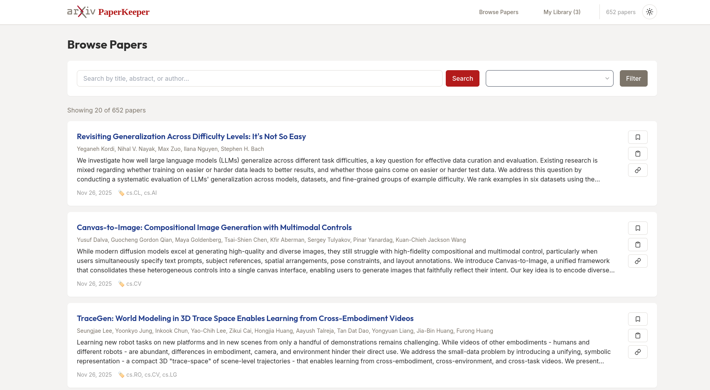

# ArXiv PaperKeeper 

A lightweight, self-hosted Go application for fetching, indexing, and browsing arXiv research papers. Built with simplicity, rich aesthetics, and power-user minimalism in mind.

## Screenshots

### Desktop Interface


---

## Features

- 🔍 **Fetch & Index**: Automatically fetch papers from arXiv based on categories and keywords.
- 📖 **Browse**: Clean, responsive UI with premium dark mode, HSL-tailored colors, and smooth cubic-bezier transitions.
- 📁 **Collections**: Organize papers in custom collections with smooth creation, renaming, and deletion controls.
- 🏷️ **Tags & Read Status**: Track reading progress and categorize papers with custom tags.
- 📊 **CSV Export**: Export your curated papers directly to a standard CSV file.
- ⚡ **Fast & Interactive**: HTMX-powered interactions with instant feedback (Toasts, NProgress).
- ⌨️ **Keyboard Shortcuts**: Focus search bar with `/`, scroll with `j`/`k`, and close modals with `Esc`.
- 🐳 **Docker Ready**: Run in a container with a single command.

---

## Quick Start

### Prerequisites
- Go 1.22+ (if running locally)
- SQLite3 (CGO-enabled)
- Docker & Docker Compose (optional)

### Local Installation

1. **Clone & Build**:
   ```bash
   git clone https://github.com/Nannigalaxy/arxiv-paperkeeper.git
   cd arxiv-paperkeeper
   make build
   ```
2. **Setup & Run**:
   ```bash
   make migrate      # Initialize the SQLite database
   make fetch        # Fetch initial arXiv papers
   make run          # Start the server (port 8080)
   ```

### Running with Docker

Run the entire application in the background with Docker Compose:
```bash
docker compose up -d
```
The application will be available immediately at `http://localhost:8075`.

---

## Configuration

Custom settings can be configured via `config.yaml` or equivalent environment variables:

```yaml
server:
  host: "0.0.0.0"
  port: 8080

database:
  path: "./data/arxiv.db"

arxiv:
  categories:
    - "cs.AI"
    - "cs.LG"
    - "cs.CL"
    - "cs.CV"
  keywords: []
  max_results: 100
  fetch_interval: 24h
  rate_limit_delay: 3s

ui:
  page_size: 20
```

### Key Environment Variables
* `SERVER_PORT`: HTTP server port (default: `8080`)
* `DB_PATH`: SQLite database file path (default: `./data/arxiv.db`)
* `ARXIV_MAX_RESULTS`: Maximum papers to fetch per interval (default: `100`)

---

## Web Interface & Keyboard Shortcuts

* **Browse Papers**: Navigate to `/` to browse all papers and filter by subcategory.
* **My Library**: Navigate to `/library` to manage read status, custom tags, and collections.
* **Manage Collections**: Group saved papers and export them dynamically using the **Export Collection** button.

| Key | Action |
| --- | --- |
| `/` | Focus Search Bar |
| `Esc` | Blur Input / Close Modals |
| `j` | Scroll Down |
| `k` | Scroll Up |

---

## Development

* **Run Tests**: `docker run --rm -v $(pwd):/app -w /app golang:1.23-alpine sh -c "apk add --no-cache gcc musl-dev sqlite-dev && go test -v ./..."` (or `make test` if Go is installed on the host)
* **Code Formatting**: `make fmt`
* **Live Reload**: `make dev` (requires [air](https://github.com/cosmtrek/air))

---

## Technology Stack

* **Backend**: Go 1.22+, chi router, sqlx, standard templates
* **Database**: SQLite3
* **Frontend**: HTMX, Tailwind CSS (CDN) with premium custom HSL styling, Lucide Icons, NProgress
* **Containerization**: Docker & Multi-stage Dockerfile

---

## License

MIT License - see LICENSE file for details

## Acknowledgments

- Inspired by [Arxiv Sanity Preserver](https://github.com/karpathy/arxiv-sanity-preserver)